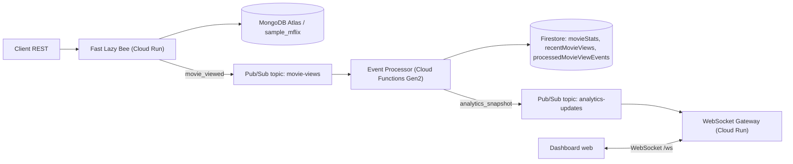

# Proiect PCD 1 - Dashboard de Analytics in Timp Real

## 1. Rezumat

Acest proiect implementeaza un sistem distribuit de analytics in timp real pornind de la aplicatia REST API Fast Lazy Bee. Aplicatia de baza gestioneaza resurse de tip film si ruleaza ca Service A in Google Cloud Run. Sistemul a fost extins astfel incat fiecare accesare a unui film prin `GET /api/v1/movies/:movie_id` publica un eveniment asincron in Google Cloud Pub/Sub. Evenimentul este procesat de o Google Cloud Function Gen2, care actualizeaza statistici agregate in Firestore si publica un snapshot de analytics catre un al doilea topic Pub/Sub. Un WebSocket Gateway, deployat tot in Cloud Run, consuma snapshot-urile si le transmite clientilor conectati. Clientul este un dashboard web minimal, servit de gateway, care afiseaza cele mai vizionate filme, activitatea recenta, numarul de clienti conectati si o estimare a latentei de actualizare.

Implementarea foloseste cel putin trei componente deployate independent: Fast Lazy Bee, Event Processor si WebSocket Gateway. Serviciile cloud native folosite sunt Cloud Run, Pub/Sub, Cloud Functions, Firestore, Artifact Registry si Cloud Build. Componenta stateful este Firestore, iar baza de date principala pentru Fast Lazy Bee este MongoDB Atlas. Comunicarea in timp real este realizata prin WebSocket, iar comunicarea inter-servicii pentru analytics este asincrona, prin Pub/Sub. Sistemul este validat live in proiectul GCP `project-0e154473-69b3-4c11-a60`.

URL-uri demo:

- Service A: `https://fast-lazy-bee-hm25rt6pha-uc.a.run.app`
- Dashboard: `https://websocket-gateway-hm25rt6pha-uc.a.run.app`
- Film demo: `https://fast-lazy-bee-hm25rt6pha-uc.a.run.app/api/v1/movies/670f5e20c286545ba702aade`

## 2. Arhitectura sistemului

Sistemul este construit in jurul unui flux event-driven. Service A raspunde cererilor REST si ramane responsabil pentru domeniul principal de date. La accesarea unui film, Service A nu calculeaza statisticile direct si nu asteapta finalizarea analytics-ului. In schimb, publica un mesaj `movie_viewed` in Pub/Sub. Aceasta decizie separa calea critica a utilizatorului de procesarea analitica.



### 2.1. Service A - Fast Lazy Bee

Fast Lazy Bee este aplicatia REST de baza, folosita in laboratoare. Ea ruleaza in Cloud Run si foloseste MongoDB Atlas ca baza de date principala. In proiect, ruta `GET /api/v1/movies/:movie_id` a fost extinsa cu un plugin `analytics-events`, care foloseste libraria `@google-cloud/pubsub` pentru a publica evenimente in topicul `movie-views`.

Evenimentul contine:

- `eventType`: `movie_viewed`
- `source`: `fast-lazy-bee`
- `movieId`
- `movieTitle`
- `requestId`
- `viewedAt`

Publicarea este tratata tolerant la erori: daca Pub/Sub nu este disponibil temporar, cererea principala de citire a filmului nu este blocata definitiv. Eroarea este logata, dar API-ul poate continua sa raspunda. Aceasta alegere favorizeaza disponibilitatea Service A.

### 2.2. Event Processor - Cloud Function

Event Processor este o functie FaaS declansata de mesajele publicate in topicul `movie-views`. Functia decodeaza mesajul Pub/Sub, verifica idempotenta pe baza ID-ului de eveniment CloudEvent si scrie in trei colectii Firestore:

- `processedMovieViewEvents`: retine evenimentele procesate pentru deduplicare.
- `movieStats`: contine agregari per film, inclusiv `viewCount`, `lastViewedAt`, `updatedAt`.
- `recentMovieViews`: pastreaza activitatea recenta pentru dashboard.

Dupa actualizarea Firestore, functia citeste un snapshot al primelor filme dupa numarul de vizualizari si al activitatii recente, apoi publica un mesaj `analytics_snapshot` in topicul `analytics-updates`.

### 2.3. WebSocket Gateway

WebSocket Gateway este un serviciu Node.js/Express deployat pe Cloud Run. El are doua responsabilitati principale:

1. Serveste clientul web minimal din folderul `public`.
2. Mentine conexiuni WebSocket la `/ws` si transmite snapshot-uri de analytics catre clienti.

Gateway-ul consuma mesajele din subscription-ul `analytics-updates-gateway-sub`. La conectarea unui client, gateway-ul citeste snapshot-ul curent din Firestore si il trimite imediat. Apoi, pentru fiecare update primit din Pub/Sub, trimite un mesaj JSON tuturor clientilor conectati.

### 2.4. Dashboard client

Dashboard-ul este o pagina HTML/CSS/JavaScript fara framework complex. Acesta se conecteaza la gateway prin WebSocket, afiseaza statusul conexiunii, numarul de clienti conectati, lista de filme top si activitatea recenta. Daca conexiunea WebSocket se inchide, clientul incearca reconectarea dupa 1.5 secunde.

## 3. Analiza comunicarii

Sistemul foloseste o combinatie de comunicare sincrona si asincrona. Comunicarea REST dintre client si Fast Lazy Bee este sincrona deoarece utilizatorul asteapta raspunsul imediat pentru resursa ceruta. Aceasta interactiune trebuie sa confirme daca filmul exista si sa returneze datele filmului.

Comunicarea dintre Fast Lazy Bee si Event Processor este asincrona prin Pub/Sub. Service A publica evenimentul si nu asteapta actualizarea Firestore. Alegerea este justificata deoarece analytics-ul nu este necesar pentru raspunsul principal al API-ului. Daca am fi folosit un apel sincron direct catre procesorul de analytics, latenta endpointului `GET /movies/:id` ar fi crescut, iar indisponibilitatea procesorului ar fi putut degrada direct experienta utilizatorului. Cu Pub/Sub, Service A este decuplat temporal de Event Processor.

Comunicarea dintre Event Processor si WebSocket Gateway este tot asincrona. Functia publica un snapshot in topicul `analytics-updates`, iar gateway-ul il consuma cand este disponibil. Aceasta abordare permite scalarea separata a procesorului si a gateway-ului. Gateway-ul poate avea clienti conectati permanent, in timp ce Event Processor porneste doar cand exista evenimente.

Comunicarea dintre Gateway si Dashboard este WebSocket. Spre deosebire de polling HTTP, WebSocket permite serverului sa impinga actualizarile catre client imediat ce apar. Aceasta alegere indeplineste cerinta de comunicare in timp real si reduce cererile inutile de refresh.

## 4. Analiza consistentei

Sistemul foloseste consistenta eventuala pentru statisticile de analytics. Cand un utilizator acceseaza un film, raspunsul REST este returnat inainte ca statistica sa fie garantat actualizata in Firestore si in dashboard. Pentru o perioada scurta, Service A si sistemul de analytics pot avea viziuni diferite asupra starii: filmul a fost accesat, dar `viewCount` nu reflecta inca accesarea.

Aceasta fereastra de inconsistente este acceptabila deoarece datele de analytics nu reprezinta o operatie critica de business precum plata sau rezervarea unui stoc limitat. In contextul teoremei CAP, sistemul favorizeaza disponibilitatea si toleranta la partitionare pentru fluxul principal. Pub/Sub actioneaza ca buffer intre producator si consumator. Daca Event Processor este temporar indisponibil, mesajele pot ramane in sistemul de mesagerie si pot fi procesate ulterior.

Firestore este folosit pentru agregari si deduplicare. Idempotenta este implementata prin colectia `processedMovieViewEvents`, unde fiecare eveniment este identificat prin ID-ul CloudEvent. Daca Pub/Sub livreaza acelasi mesaj de mai multe ori, functia observa ca mesajul a fost deja procesat si nu incrementeaza din nou `viewCount`. Aceasta este importanta deoarece Pub/Sub ofera o garantie de livrare de tip at-least-once, ceea ce inseamna ca duplicarea este posibila.

Exista o distinctie importanta intre duplicate reale si evenimente distincte cu acelasi continut. Daca acelasi mesaj Pub/Sub este relivrat, are acelasi ID si este deduplicat. Daca utilizatorul acceseaza acelasi film de mai multe ori, fiecare accesare produce un eveniment separat, cu ID diferit, si trebuie contorizata separat.

## 5. Performanta si scalabilitate

Componentele sunt deployate pe servicii serverless, deci scalarea este gestionata de platforma. Fast Lazy Bee si WebSocket Gateway ruleaza in Cloud Run cu `min-instances 1` si `max-instances 3`. Cloud Function Gen2 porneste la evenimente si poate scala in functie de volumul de mesaje. Pub/Sub decupleaza rata de productie a evenimentelor de rata de procesare.

Validarea live a fost facuta pe filmul demo `670f5e20c286545ba702aade`. Dupa trimiterea mai multor cereri catre endpointul filmului, Firestore a continut documentul:

```json
{
  "movieId": "670f5e20c286545ba702aade",
  "movieTitle": "PCD Demo Movie",
  "viewCount": 6,
  "lastViewedAt": "2026-04-25T07:11:35.489Z",
  "updatedAt": "2026-04-25T07:11:36.190Z"
}
```

In acest exemplu, diferenta dintre `lastViewedAt` si `updatedAt` este aproximativ 701 ms. Aceasta reprezinta o observatie concreta pentru fereastra de consistenta dintre accesarea filmului si actualizarea agregarii in Firestore. In testele initiale, unele evenimente au avut intarzieri mai mari deoarece permisiunea de invocare a functiei nu era inca setata complet; dupa corectarea IAM, evenimentele au fost procesate normal.

Un test simplu cu 5 cereri secventiale catre endpointul filmului a durat aproximativ 1.84 secunde in total, adica aproximativ 368 ms per cerere. Aceasta masuratoare include latenta retelei, Cloud Run, accesul la MongoDB Atlas si publicarea evenimentului Pub/Sub. Pentru o analiza mai completa ar trebui rulate teste cu `hey` sau un instrument echivalent, pe mai multe niveluri de concurenta, colectand p50, p95, p99 si rata de erori.

Bottleneck-uri posibile:

- MongoDB Atlas M0 este un cluster gratuit, cu resurse limitate.
- Cold starts pot aparea daca min-instances este redus la 0.
- Cloud Function are memorie si CPU limitate in configuratia implicita.
- Gateway-ul WebSocket tine conexiuni active; la multi clienti poate necesita scalare si strategie de fan-out mai avansata.

## 6. Rezilienta

Sistemul are mecanisme de rezilienta la mai multe niveluri. Cloud Run reporneste automat instantele care esueaza si poate scala serviciile in limita configurata. Pub/Sub pastreaza mesajele si permite retry in cazul in care un consumator nu proceseaza mesajul. Firestore este un serviciu gestionat si elimina nevoia de administrare manuala a unei baze de date pentru analytics.

Daca Event Processor este indisponibil, Service A poate continua sa raspunda cererilor REST. Evenimentele raman in Pub/Sub si pot fi procesate ulterior. Aceasta izolare previne propagarea directa a defectului catre utilizatorul care doar citeste datele filmului. Daca Gateway-ul WebSocket este indisponibil, dashboard-ul nu primeste update-uri in timp real, dar Service A si Event Processor continua sa functioneze. La revenirea Gateway-ului, clientul se reconecteaza si primeste snapshot-ul curent din Firestore.

Daca Pub/Sub este indisponibil, Service A logheaza eroarea de publicare. In implementarea curenta nu exista un mecanism local de retry in Service A, deci unele evenimente de analytics ar putea fi pierdute in acel scenariu. Pentru productie, o imbunatatire ar fi un buffer local persistent, retry cu backoff sau un dead-letter topic.

## 7. Comparatie cu sisteme reale

Arhitectura seamana cu pattern-uri folosite de platforme precum Netflix, YouTube sau Twitter/X pentru colectarea de evenimente de utilizare. In astfel de sisteme, actiunea principala a utilizatorului nu asteapta actualizarea tuturor statisticilor. De exemplu, cand un utilizator vizualizeaza un video, evenimentul este trimis catre un sistem de streaming sau coada de mesaje, apoi servicii independente actualizeaza recomandari, dashboard-uri, contoare si rapoarte.

Similaritatea principala este separarea dintre calea tranzactionala si calea analitica. Fast Lazy Bee returneaza filmul, iar analytics-ul este procesat ulterior. In sisteme reale, Pub/Sub ar putea fi inlocuit sau completat cu Kafka, Flink, Dataflow sau BigQuery streaming. Diferenta este de scala: proiectul foloseste un singur topic pentru evenimente si un singur gateway, in timp ce un sistem real are partitionare, schema registry, politici stricte de retention, dead-letter queues, observabilitate avansata si procesare pe ferestre temporale.

O alta diferenta este fan-out-ul catre clienti. In proiect, Gateway-ul transmite snapshot-uri tuturor clientilor conectati. Intr-un sistem real, ar exista probabil canale separate pe tenant, utilizator, regiune sau tip de eveniment. De asemenea, ar fi necesare autentificare, autorizare si rate limiting.

## 8. Instructiuni de build, deploy si testare

Folderul proiectului este:

```powershell
C:\Users\Dragos\OneDrive\Studying Software Engineering\MISS1202O2 Concurrent and Distributed Programming\module2\project1-real-time-analytics
```

Build local pentru Service A:

```powershell
cd fast-lazy-bee
npm install
npm run build
```

Deploy complet:

```powershell
cd "C:\Users\Dragos\OneDrive\Studying Software Engineering\MISS1202O2 Concurrent and Distributed Programming\module2\project1-real-time-analytics"
.\scripts\deploy.ps1 -ProjectId "project-0e154473-69b3-4c11-a60" -MongoUrl "<mongodb-atlas-url>"
```

Test rapid dupa deploy:

```powershell
curl.exe "https://fast-lazy-bee-hm25rt6pha-uc.a.run.app/api/v1/health"
curl.exe "https://fast-lazy-bee-hm25rt6pha-uc.a.run.app/api/v1/movies/670f5e20c286545ba702aade"
```

Dashboard:

```text
https://websocket-gateway-hm25rt6pha-uc.a.run.app
```

## 9. Limitari si imbunatatiri

Implementarea curenta este potrivita pentru demonstratie si evaluarea conceptelor PCD, dar are limitari clare. Functia Cloud Run din spatele Cloud Function a fost facuta invocabila public pentru a debloca triggerul Eventarc in proiectul de laborator. Pentru productie, ar trebui folosita o configuratie IAM mai stricta, in care doar service account-ul Eventarc are rolul `roles/run.invoker`.

De asemenea, dashboard-ul trimite snapshot-uri complete, nu update-uri diferentiale. Pentru volum mare de date, ar fi mai eficient sa se transmita doar schimbarile. Nu exista dead-letter queue pentru mesaje esuate repetat si nu exista rate limiting pe endpointurile Fast Lazy Bee. Load testing-ul este minimal; o analiza riguroasa ar trebui sa includa teste controlate cu concurenta 10, 50 si 100, plus grafice p50/p95/p99.

## 10. Utilizarea instrumentelor de inteligenta artificiala

La implementare si redactare a fost folosit ChatGPT/Codex ca asistent de programare. Instrumentul a fost folosit pentru interpretarea cerintelor din assignment, generarea codului pentru serviciile noi, configurarea scripturilor de deploy, diagnosticarea erorilor GCP/Atlas, redactarea documentatiei si structurarea raportului.

Continutul generat a fost validat prin build local, verificari de sintaxa, deploy live in Google Cloud, apeluri reale catre endpointuri, inspectarea logurilor Cloud Function si verificarea documentelor Firestore prin API. Configuratiile generate au fost adaptate manual pe baza erorilor reale aparute in timpul deploymentului, inclusiv activarea Eventarc, configurarea IAM pentru Cloud Build si Cloud Run invoker, alegerea unei regiuni Atlas M0 disponibile si adaugarea fisierelor `.gcloudignore`.

Autorii proiectului raman responsabili pentru cod, configuratie, raport si rezultatele prezentate.
